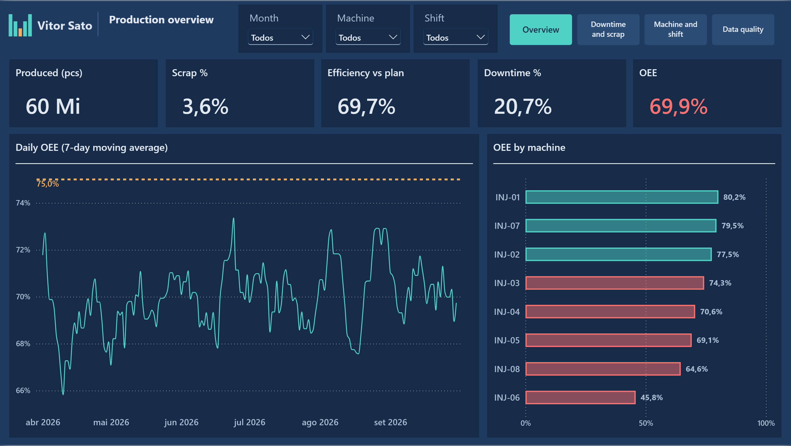
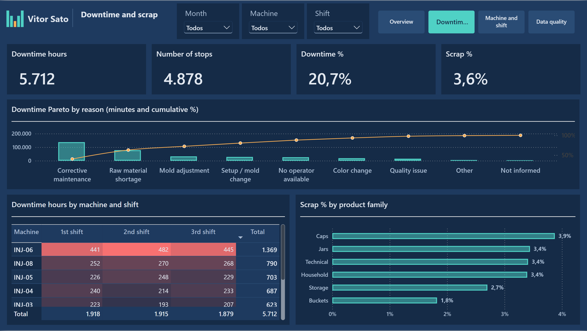
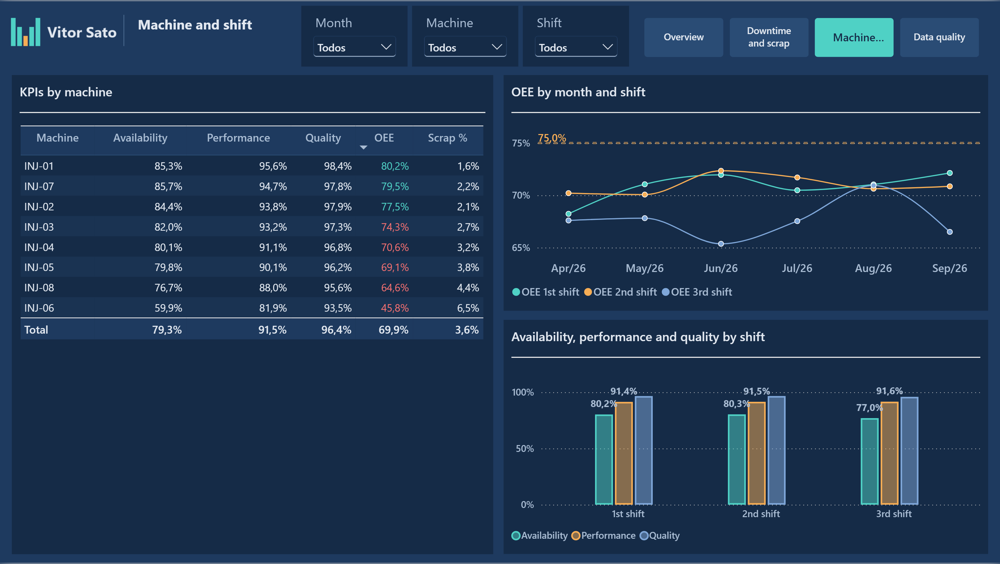
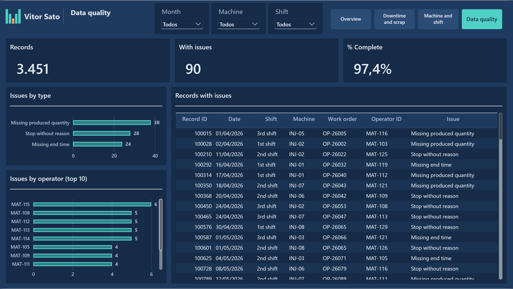

# Manufacturing KPIs — Why do the machines stop?

**Power BI · DAX · Power Query · Python (synthetic data)**
Portfolio project by **Vitor Sato** — BI for manufacturing and construction.



> All data in this project is **100% fictitious**, generated by a Python script with a fixed seed. The business problems are real ones I have seen on shop floors.

## The business problem

A plastic injection molding plant ("Fábrica Exemplo") runs 8 machines in 3 shifts. Production was tracked by operators in a system export and in spreadsheets. Management could not answer three basic questions:

1. **How efficient is each machine, really?** There was no single number combining downtime, speed and scrap.
2. **Why do the machines stop?** Each record had up to 5 stop reasons in separate columns, impossible to rank.
3. **Can we trust the records?** Some shifts had no produced quantity, no end time, or stops without a reason.

## What the dashboard shows

| Page | Question it answers |
|---|---|
| **Production overview** | Are we on target? OEE vs. 75% target, 7-day moving average, ranking of machines (red = below target) |
| **Downtime and scrap** | Where do we lose time? Pareto of stop reasons, heat map of downtime by machine × shift, scrap by product family |
| **Machine and shift** | Which machine or shift drags OEE down? Availability, performance and quality per machine and per shift |
| **Data quality** | Which records must be fixed, and by whom? Incomplete records by type and by operator, with the full list |

### What a manager learns in one click (fictitious data)

- **2 reasons explain 63% of downtime**: corrective maintenance (40%) and raw material shortage (23%).
- **One machine is the outlier**: INJ-06 (built in 2009) runs at **46% OEE** against a 75% target; the best machine reaches 80%.
- **The 3rd shift (night) is the weakest** on availability.
- **2.6% of records are incomplete** — the dashboard lists each one with the operator ID, so it can be fixed at the source.

| | |
|---|---|
|  |  |
|  | |

## How it was built

### Data (Python)
`dados/gerar_dados.py` generates a realistic export of a shop-floor system: 3,451 records (Apr–Sep 2026), 8 machines with different ages and behaviour, 30 products, 8 stop reasons, ~3% of records with deliberate errors. Same seed → same files.

### Power Query (M)
- Dates arrive as text (`dd/mm/yyyy`) and are converted with an explicit culture.
- **Night shift crosses midnight** (22:00–06:00): end time is moved to the next day before computing duration.
- The **5 pairs of "stop reason / minutes" columns are unpivoted into one row per stop** (`fParadas`), which makes the Pareto possible.
- A `Problema` column flags each record as OK or with its first issue.
- File path in a single parameter; source queries are not loaded (staging).

### Data model
Star schema: 2 fact tables (`fApontamentos` = production records, `fParadas` = stops) and 5 dimensions (calendar, machine, product, shift, stop reason). Own calendar table, auto date/time disabled, technical columns hidden. Dimension tables carry Portuguese and English names, so the same model serves both report versions.

### Key DAX measures
- **OEE = Availability × Performance × Quality**
  - Availability = operating time / planned time
  - Performance = ideal time (quantity × ideal cycle / cavities) / operating time
  - Quality = good parts / produced parts
- Records without produced quantity are excluded from OEE (they appear only on the data-quality page).
- **Pareto cumulative %** that works on any axis column (`CALCULATETABLE` + `ALLSELECTED`).
- **7-day moving average** with `DATESINPERIOD`.
- OEE per shift with `CALCULATE` + `KEEPFILTERS`, so the shift slicer still works.
- Measure-driven colour (red below target) used across visuals.

### Report
Custom dark theme, 4 pages with synced slicers and page navigation, Portuguese and English versions of the same report on one shared semantic model. Built as a **PBIP project (TMDL + PBIR)** and versioned in git.

## Repository structure

```
dados/                          synthetic data generator + generated Excel files
Demo-b-produção.SemanticModel/  semantic model (TMDL)
Demo-b-produção.Report/         report, Portuguese
Demo-b-production-EN.Report/    report, English
prints/                         screenshots (en/, pt/)
```

## How to open it

1. Install Power BI Desktop (free).
2. Clone this repository.
3. Open `Demo-b-production-EN.pbip` (English) or `Demo-b-produção.pbip` (Portuguese).
4. If asked, set the parameter `CaminhoDados` to the full path of the `dados/` folder and click **Refresh**.

## About me

Data analyst in São Paulo, Brazil. Before data, I spent years implementing systems and running projects with manufacturing and construction clients, so I start from the process and only then build the metrics.

- LinkedIn: [linkedin.com/in/vitorsato](https://www.linkedin.com/in/vitorsato)
- E-mail: vitorsato@icloud.com
